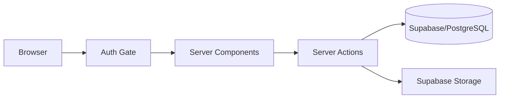

# MAPRIMO Technologies Platform

<div align="center">
  
  
  
  
  
  <br />
  
  
</div>

---

## 🚀 Overview
**MAPRIMO Technologies** is an enterprise-grade platform combining a high-performance marketing frontend with a hardened administrative CMS. Built for technical agencies, it features automated content lifecycles, real-time observability, and a security-first data model.

## 🏗️ Architecture
The system utilizes a **Unidirectional Data Flow** with strict server-side validation boundaries.



### Core Design Principles
*   **Zero-Trust mutations:** Every Server Action validates admin session and Zod schemas before hitting the DB.
*   **Source-of-truth Security:** Row Level Security (RLS) acts as the final firewall at the database level.
*   **Optimistic UI:** CMS uses `useTransition` and `useOptimistic` for instantaneous feedback during CRUD operations.

---

## 📂 Project Structure
| Path | Responsibility |
| :--- | :--- |
| `app/(marketing)` | Public routes (Home, Work, Blog, Services) |
| `app/admin` | Gated CMS Dashboard and Management |
| `components/admin` | CMS-specific forms, tables, and editors |
| `lib/actions` | Domain-specific Server Actions (Mutations) |
| `lib/supabase` | Hardened client initializers (Server/Client/Admin) |
| `tests/` | Multi-tier testing suite (E2E, Unit, Security) |

---

## 🛠️ System Components

### 1. Content Management (CMS)
*   **Projects & Case Studies:** Full CRUD with automated storage cleanup.
*   **Insights Engine:** Markdown-based Blog and Podcast management.
*   **Leadership Team:** Sorted directory of agency directors.

### 2. Lead Generation
*   **Hardened Forms:** Integrated honeypot bot protection.
*   **Rate Limiting:** IP-based throttling to prevent API abuse.
*   **Sync (Planned):** Automated Google Sheets and Calendar integration.

### 3. Observability & Reliability
*   **Error Tracking:** Production-grade Sentry integration.
*   **Structured Logging:** JSON logs for real-time monitoring via `lib/logger.ts`.
*   **Health API:** Dedicated `/api/health` heartbeat for DB/API status.

---

## 🛡️ Security & Performance
*   **RLS Policies:** Granular access control (e.g., Anon can read published, Admin can CRUD).
*   **Hardened Headers:** Configured HSTS, CSP, and Frame Options in `next.config.mjs`.
*   **Dynamic Rendering:** `force-dynamic` ensures CMS updates are reflected instantly without cache stale-out.
*   **Optimized Assets:** Automatic WebP conversion and lazy loading via `next/image`.

---

## 🚦 Getting Started

### Environment Variables
Create a `.env.local` file with the following:
```bash
NEXT_PUBLIC_SUPABASE_URL=your_project_url
NEXT_PUBLIC_SUPABASE_ANON_KEY=your_anon_key
SUPABASE_SERVICE_ROLE_KEY=your_service_role_key
NEXT_PUBLIC_SITE_URL=http://localhost:3000
```

### Installation
```bash
# Install dependencies
npm install

# Start development server
npm run dev

# Run test suite
npm run test:ci
```

---

## 📜 License
Distributed under the **MIT License**. See `LICENSE` for more information.

---

<div align="center">
  Built with Precision by MAPRIMO Engineering
</div>

